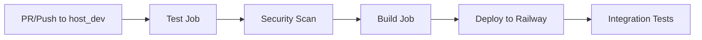

# 🚀 CI/CD Pipeline & Deployment Guide

## 📋 Overview

This project uses **GitHub Actions** for CI/CD with automated testing, security scanning, building, and deployment to **Railway**.

## 🔧 Pipeline Structure



## 🛠️ Jobs Breakdown

### 1. **Test Job** 🧪
- ✅ Sets up JDK 17
- ✅ Caches Maven dependencies
- ✅ Runs unit & integration tests
- ✅ Generates test reports
- ✅ Uploads test results & coverage

### 2. **Security Scan** 🔒
- ✅ OWASP dependency vulnerability check
- ✅ Security report generation
- ✅ Artifact upload for review

### 3. **Build Job** 🔨
- ✅ Compiles application
- ✅ Packages JAR file
- ✅ Uploads build artifacts

### 4. **Deploy Job** 🚀
- ✅ Deploys to Railway (on push to host_dev)
- ✅ Uses production profile
- ✅ Slack notifications
- ✅ Health check verification

### 5. **Integration Tests** ✅
- ✅ Post-deployment API testing
- ✅ Health check validation
- ✅ Endpoint verification

## 📝 Required GitHub Secrets

Set these in your repository: **Settings** → **Secrets and variables** → **Actions**

### Railway Secrets
```
RAILWAY_TOKEN=your_railway_token_here
RAILWAY_SERVICE_ID=your_service_id_here
RAILWAY_APP_URL=https://your-app.railway.app
```

### Environment Variables
```
JWT_SECRET=your_production_jwt_secret_key_here
DATABASE_URL=your_postgresql_connection_string
DATABASE_USERNAME=your_db_username
DATABASE_PASSWORD=your_db_password
PAYHERE_MERCHANT_ID=your_payhere_merchant_id
PAYHERE_MERCHANT_SECRET=your_payhere_merchant_secret
SENDGRID_API_KEY=your_sendgrid_api_key
CORS_ALLOWED_ORIGINS=https://your-frontend-domain.com
```

### Optional Notifications
```
SLACK_WEBHOOK_URL=your_slack_webhook_url (optional)
```

## 🔄 Deployment Workflow

### Development Flow
1. **Create feature branch** from `host_dev`
2. **Make changes** and commit
3. **Create Pull Request** → Triggers test pipeline
4. **Merge to host_dev** → Triggers full CI/CD pipeline

### Manual Deployment
```bash
# Using Railway CLI
railway login
railway link [project-id]
railway up
```

## 📊 Environment Profiles

### **Local Development** (`default`)
- H2/PostgreSQL local database
- Debug logging enabled
- Hot reload with DevTools

### **Testing** (`test`)
- In-memory H2 database
- Mock external services
- Detailed test logging

### **Production** (`production`)
- PostgreSQL database
- Optimized logging
- Security headers enabled
- Health monitoring

## 🔧 Local Setup for CI/CD Testing

### 1. Install Dependencies
```bash
# Install Maven wrapper
./mvnw clean install

# Run tests locally
./mvnw test

# Run with test profile
./mvnw spring-boot:run -Dspring.profiles.active=test
```

### 2. Docker Testing
```bash
# Build Docker image
docker build -t tutor-platform-auth .

# Run container
docker run -p 8080:8080 \
  -e SPRING_PROFILES_ACTIVE=production \
  -e DATABASE_URL=your_db_url \
  tutor-platform-auth
```

### 3. Railway Local Development
```bash
# Install Railway CLI
npm install -g @railway/cli

# Login and link project
railway login
railway link

# Run with Railway environment
railway run mvn spring-boot:run
```

## 📈 Monitoring & Health Checks

### Health Endpoints
- **Main Health**: `/api/actuator/health`
- **Detailed Info**: `/api/actuator/info`
- **Metrics**: `/api/actuator/metrics`
- **Prometheus**: `/api/actuator/prometheus`

### Log Monitoring
```bash
# View Railway logs
railway logs

# Follow logs in real-time
railway logs --follow
```

## 🚨 Troubleshooting

### Common Issues

#### **Build Failures**
```bash
# Clean and rebuild
./mvnw clean compile
./mvnw dependency:resolve
```

#### **Test Failures**
```bash
# Run specific test
./mvnw test -Dtest=AuthControllerTest

# Skip tests temporarily
./mvnw package -DskipTests
```

#### **Railway Deployment Issues**
```bash
# Check service status
railway status

# View deployment logs
railway logs --deployment

# Restart service
railway restart
```

## 🔐 Security Checklist

- ✅ **Environment variables** for secrets
- ✅ **OWASP dependency scanning**
- ✅ **Non-root Docker user**
- ✅ **HTTPS enforcement** in production
- ✅ **Security headers** enabled
- ✅ **Database connection pooling**

## 📚 Additional Resources

- [Railway Documentation](https://docs.railway.app)
- [GitHub Actions Documentation](https://docs.github.com/en/actions)
- [Spring Boot Actuator](https://docs.spring.io/spring-boot/docs/current/reference/html/actuator.html)
- [Maven Surefire Plugin](https://maven.apache.org/surefire/maven-surefire-plugin/)

## 🎯 Next Steps

1. **Configure GitHub Secrets** with your Railway and external service credentials
2. **Test the pipeline** by creating a pull request to `host_dev`
3. **Monitor deployment** in Railway dashboard
4. **Set up monitoring** with Railway metrics
5. **Configure domain** and SSL in Railway